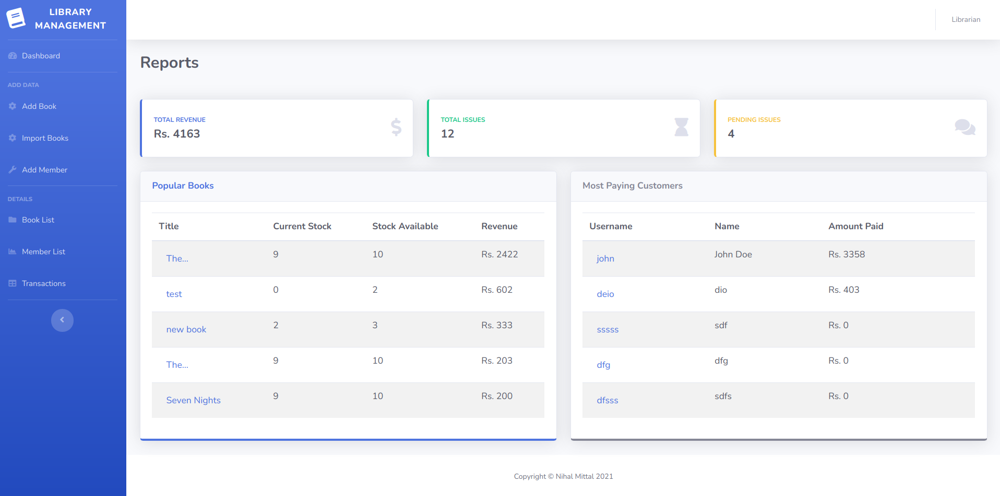

# Library Management - Frappe Dev Hiring

## Hosted Application

[https://agentx703.pythonanywhere.com/](https://agentx703.pythonanywhere.com/)

Book import through API from hosted site won't work as pythonanywhere blacklists pubic API from free account

## Development Environment Setup
1. Create a .env file in root directory with following variable - SQLALCHEMY_DATABASE_URI and SECRET_KEY
2. Run app.py file

## Backend Framework
Flask

## Test Coverage
95%

## Formatter
Black

## Database Used
SQLite3

## ORM used
SQLAlchemy

## Form used
Wtforms

## CSS Framework Used
Bootstrap

## Screenshots

 
  

 
  

 
  

 
  

 
  

 
  

 
  

 
  

 
  

 
  

 
  

